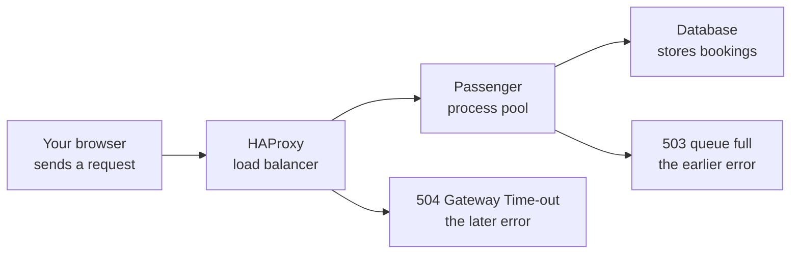

# A `SizedQueue` that refuses is the 503 behind "queue full"

**Level:** 201 · anyone who has met "This website is under heavy load (queue full)" and wants to know whose fault it is

**One line:** Passenger answers a Rails app's requests from a fixed pool of processes, 6 by default, through a request queue with a cap, 100 by default, and "This website is under heavy load (queue full)" is that queue's non-blocking push refusing instead of waiting: on a millisecond clock the queue fills in ten seconds once requests arrive a third faster than the pool clears them, and refusing at once keeps everyone else's wait under four seconds where an uncapped queue reaches twenty; a request that does get in and then outlasts the load balancer's patience is the other error, HAProxy's 504. Ruby's `SizedQueue#push(job, true)` raises `ThreadError: queue full` for the same reason, and Python's `queue.Queue(maxsize=100).put_nowait` raises `queue.Full`.

The page is Phusion Passenger's stock answer, status 503, when its request queue is full. Passenger is an application server, usually a module inside Nginx, that keeps a pool of application processes running and hands each request to a free one; in the open-source edition a Ruby process answers one request at a time, so a pool of 6 is working on 6 requests and no more, the seventh waits in a queue, and the queue has a cap. All three are configuration: `passenger_max_pool_size`, default 6; `passenger_max_request_queue_size`, default 100, with 0 for no cap; and `passenger_request_queue_overflow_status_code`, default 503. Passenger serves Node and Python apps too, so the page proves Passenger and only makes Rails likely *(Not machine-checked here.)*.

Sections 1 to 7 simulate that arrangement on a clock that ticks once a millisecond: requests arrive on a timetable, every process takes a fixed time over one request, a request that finds every process busy waits in the queue, and one that finds the queue full is refused with a 503 on the spot. The load balancer in front of Passenger is one more number. HAProxy waits `timeout server` for an answer, 30 s here, and then sends a 504 Gateway Time-out itself, whether or not Passenger finishes the request later; the simulation counts a request as a 504 when its wait plus its service time passes that. Sections 8 to 10 are the class a request queue would be written with: `SizedQueue#push(job, true)` raises `ThreadError` with the message `queue full`, `push(job, timeout: 0)` gives up at once with `nil`, and a plain `Queue` takes item number 100001 without a word.

<!-- output:a_sized_queue_that_refuses_rb -->
*Verified output of [`a_sized_queue_that_refuses_rb.rb`](examples/a_sized_queue_that_refuses_rb.rb) — regenerated by `tools/run_examples.py`, never hand-typed.*

```text
Passenger's defaults: a pool of 6 processes, each answering one request
at a time, in front of a request queue of 100. When a request takes 200 ms,
the pool answers at most 30 a second. HAProxy, in front, waits
30 s for an answer and then sends a 504 itself.
(A simulation on a millisecond clock, not Passenger or HAProxy themselves.)

 1. 25 requests/s for 60 s: under the 30/s the pool clears
   peak queue in second 5 / 20 / 40 / 60      0 / 0 / 0 / 0    never full
   longest wait in the queue                  0.0 s
   refused with 503 (Passenger: queue full)   0 of 1500
   timed out with 504 (HAProxy: 30 s passed)  0 of 1500
   queue empty again                          0.2 s after the last arrival

 2. 40 requests/s for 60 s: over 30/s, queue capped at 100
   peak queue in second 5 / 20 / 40 / 60      50 / 100 / 100 / 100    full from 10.0 s
   longest wait in the queue                  3.3 s
   refused with 503 (Passenger: queue full)   500 of 2400
   timed out with 504 (HAProxy: 30 s passed)  0 of 2400
   queue empty again                          3.5 s after the last arrival

 3. the same 40 requests/s, queue uncapped
   peak queue in second 5 / 20 / 40 / 60      50 / 200 / 400 / 600    never full
   longest wait in the queue                  19.9 s
   refused with 503 (Passenger: queue full)   0 of 2400
   timed out with 504 (HAProxy: 30 s passed)  0 of 2400
   queue empty again                          20.1 s after the last arrival

 4. 25 requests/s again, but a slow database: 2000 ms per request
   peak queue in second 5 / 20 / 40 / 60      100 / 100 / 100 / 100    full from 4.7 s
   longest wait in the queue                  33.8 s
   refused with 503 (Passenger: queue full)   1220 of 1500
   timed out with 504 (HAProxy: 30 s passed)  184 of 1500
   queue empty again                          34.1 s after the last arrival

 5. a registration window: 200 requests in the first second, then 20/s
   peak queue in second 5 / 20 / 40 / 60      69 / 0 / 0 / 0    full from 0.5 s
   longest wait in the queue                  3.3 s
   refused with 503 (Passenger: queue full)   71 of 1380
   timed out with 504 (HAProxy: 30 s passed)  0 of 1380
   queue empty again                          0.2 s after the last arrival

 6. the same window, queue uncapped
   peak queue in second 5 / 20 / 40 / 60      140 / 0 / 0 / 0    never full
   longest wait in the queue                  5.6 s
   refused with 503 (Passenger: queue full)   0 of 1380
   timed out with 504 (HAProxy: 30 s passed)  0 of 1380
   queue empty again                          0.2 s after the last arrival

 7. the database locks up: 5 requests/s, 40 000 ms per request
   peak queue in second 5 / 20 / 40 / 60      19 / 94 / 100 / 100    full from 21.2 s
   longest wait in the queue                  679.4 s
   refused with 503 (Passenger: queue full)   188 of 300
   timed out with 504 (HAProxy: 30 s passed)  112 of 300
   queue empty again                          700.8 s after the last arrival

 8. SizedQueue.new(100): push 100, then push(job, true)  ThreadError: queue full
 9. push(job, timeout: 0) on the full queue              nil
10. Queue.new has no cap: push number 100001             size 100001
```
<!-- /output -->

## Reading the output

**Section 1 is a pool with room.** 25 requests a second against a pool that clears 30: the queue never forms, every request waits 0.0 s, nothing is refused, and the last request is answered 0.2 s after it arrives, which is its own service time. Real traffic is not a timetable, so a real pool five sixths busy would see short queues now and then; the timetable is what makes every number here exact *(Not machine-checked here.)*.

**Section 2 is the page in the screenshot.** 40 requests a second is ten more than the pool clears, so the queue grows by ten a second: 50 at most in second 5, full from 10.0 s, and from then on one request in four is refused, 500 of 2400. The refusal is what bounds the wait: the longest anyone stood in line was 3.3 s, 100 places at 30 a second, and the backlog was gone 3.5 s after the traffic stopped.

**Section 3 is the same traffic with the cap removed.** Nobody is refused, and the queue reaches 600 by the last second, the last request in waited 19.9 s, and the line takes 20.1 s to clear after the traffic stops. Refusing 500 people at once bought the other 1900 a worst case of 3.3 s; refusing nobody gave all 2400 a worst case of 20 s and rising. Another minute at this rate and the wait passes HAProxy's 30 s, at which point requests still in line are answered 504 while Passenger goes on to run them anyway, the worst of both.

**Section 4 is a slow database.** The same 25 requests a second that section 1 took in its stride, with each request now taking 2 s instead of 200 ms. The pool clears 3 a second, the queue is full from 4.7 s, 1220 of 1500 are refused, and the requests that did get in waited up to 33.8 s, so 184 of them were answered by HAProxy with a 504 before Passenger finished. A slow dependency is a smaller pool in disguise: six processes at 2 s each are the capacity of one process at 333 ms.

**Sections 5 and 6 are a registration window opening.** 200 requests in the first second, then 20 a second. With the cap, the queue is full from 0.5 s, 71 requests are refused in that first second, and then the line shrinks by ten a second: 69 at its peak in second 5, empty before second 20, nobody waits longer than 3.3 s. Without the cap, the line peaks at 140, nobody is refused, and the longest wait is 5.6 s. The cap refused 71 people who would have been served within six seconds. It is tuned for sustained overload, sections 2 to 4, where it is the only thing keeping the wait bounded; a one-second stampede is served better by a bigger pool, which is exercise 1, or a bigger cap.

**Section 7 is the database locking up.** Five requests a second, a trickle, but each one takes 40 s because it is waiting on a lock. The queue has room for the first 21 s, so nobody gets a 503, and every one of the 112 requests that got in is answered 504 by HAProxy at 30 s while Passenger keeps its process on the request for the full 40; the queue is full from 21.2 s, 188 more are refused, and the line takes 700.8 s, nearly twelve minutes, to clear after the last arrival. That is the 504 that follows a 503 by ten minutes: the queue has room again, and the requests that get in do not come back in time.

**Rows 8 to 10 are the class.** A `SizedQueue` of 100 takes 100 pushes and raises `ThreadError: queue full` on the non-blocking 101st, `push(job, timeout: 0)` returns `nil` instead of raising, and a `Queue` with no cap holds 100001 items. Passenger's request queue is not a Ruby `SizedQueue`, it lives in Passenger's C++ core, but the behaviour on the page is this row: a push that refuses rather than blocks *(Not machine-checked here.)*.

## The layers, and which one said no



**HAProxy** is the front door: a reverse proxy and load balancer that accepts every connection, hands each request to a backend and relays the answer. The *gateway* in "504 Gateway Time-out" is HAProxy naming itself: it is the gateway between the browser and the application. **Passenger** is the application server behind it, keeping the pool of Rails processes alive and feeding them requests. **The Rails app and its database** do the work: look up the membership, check the class's capacity, write the booking. Almost every request on a booking site touches the database *(Not machine-checked here.)*.

The two errors are two different failures. A 503 with "queue full" is Passenger refusing on the spot, before any work: fast and deliberate, sections 2, 4, 5 and 7. A 504 is HAProxy giving up: it accepted the request, forwarded it, waited its `timeout server`, commonly 30 to 60 s, and heard nothing. The request may still be grinding away behind it or may have died; HAProxy knows only that nobody answered in time, sections 4 and 7. On the morning this page was written a class-booking site answered 503 at 8:17 and 504 at 8:27, which is the classic order: first the queue overflowed, too many people for too few processes; ten minutes later the queue had room again, but the requests that got through were taking longer than HAProxy's patience. That points at the database. Hundreds of people claiming the last places in the same classes contend for the same rows, every request slows down together, and more application processes make it worse, since they only add writers to the same lock *(Not machine-checked here.)*.

What the page says about the site, then, is not that the technology is poor. HAProxy, Nginx with Passenger, Rails and a relational database is a boring, reliable stack in the best sense, the shape of thousands of working web businesses, and the 503 is that stack doing what it was designed to do: shed load instead of falling over. What it shows is a capacity and architecture mismatch, a system provisioned for a steady trickle of gym check-ins meeting a ticket-sale burst. The fixes are the ordinary ones: a pool sized for the peak, which for section 2's traffic is 8 processes, exercise 1; a virtual waiting room in front of HAProxy, which is a queue that admits people at the rate the pool clears and tells them their place instead of a 503; registration windows staggered so the burst is smaller; and a booking write path that does not put hundreds of writers on one row. None of them replaces the technology. The club's own subdomain suggests each customer has its own application, so one club's stampede fills its own queue rather than the whole platform's, which is cheaper to run and means no borrowing from idle neighbours; from outside, the page cannot tell you which *(Not machine-checked here.)*.

For a member trying to book: after a 503, section 5 says the line is gone within twenty seconds of the burst ending, so waiting a few minutes and retrying usually works. After a 504, section 7 says retrying does nothing until whatever is holding the database lets go. If it happens every week at the same time, that is a complaint worth sending to the club: it is fixable with more processes or a waiting room, and the club is the platform's customer.

## Compared with Python

The seven simulated sections print the same numbers in Python, as they must: they are integer arithmetic on the same timetables. The classes differ in shape. Ruby has two, `Queue` with no cap and `SizedQueue` with one; Python has one, `queue.Queue(maxsize=n)`, where `maxsize=0`, the default, means no cap (row 10). Both refuse without blocking, `push(job, true)` against `put_nowait(job)`, and both name the exception after the queue: Ruby's is a `ThreadError` whose message is `queue full`, Python's is `queue.Full` (row 8). The one behavioural difference is row 9: Ruby's `push(job, timeout: 0)` returns `nil` when it cannot push, Python's `put(job, timeout=0)` raises `Full` all the same, so a Ruby caller checks the return and a Python caller catches. Passenger serves Python's WSGI apps the same way it serves Rails, one request per process in the open-source edition, with the same queue and the same page; Gunicorn, the Python server more often seen behind a load balancer, has no application queue of its own, only the kernel's listen backlog (`--backlog`, default 2048), and when that is full the connection attempt is dropped and no page is served at all *(Not machine-checked here.)*.

<!-- output:a_sized_queue_that_refuses_py -->
*Verified output of [`a_sized_queue_that_refuses_py.py`](examples/a_sized_queue_that_refuses_py.py) — regenerated by `tools/run_examples.py`, never hand-typed.*

```text
Passenger's defaults: a pool of 6 processes, each answering one request
at a time, in front of a request queue of 100. When a request takes 200 ms,
the pool answers at most 30 a second. HAProxy, in front, waits
30 s for an answer and then sends a 504 itself.
(A simulation on a millisecond clock, not Passenger or HAProxy themselves.)

 1. 25 requests/s for 60 s: under the 30/s the pool clears
   peak queue in second 5 / 20 / 40 / 60      0 / 0 / 0 / 0    never full
   longest wait in the queue                  0.0 s
   refused with 503 (Passenger: queue full)   0 of 1500
   timed out with 504 (HAProxy: 30 s passed)  0 of 1500
   queue empty again                          0.2 s after the last arrival

 2. 40 requests/s for 60 s: over 30/s, queue capped at 100
   peak queue in second 5 / 20 / 40 / 60      50 / 100 / 100 / 100    full from 10.0 s
   longest wait in the queue                  3.3 s
   refused with 503 (Passenger: queue full)   500 of 2400
   timed out with 504 (HAProxy: 30 s passed)  0 of 2400
   queue empty again                          3.5 s after the last arrival

 3. the same 40 requests/s, queue uncapped
   peak queue in second 5 / 20 / 40 / 60      50 / 200 / 400 / 600    never full
   longest wait in the queue                  19.9 s
   refused with 503 (Passenger: queue full)   0 of 2400
   timed out with 504 (HAProxy: 30 s passed)  0 of 2400
   queue empty again                          20.1 s after the last arrival

 4. 25 requests/s again, but a slow database: 2000 ms per request
   peak queue in second 5 / 20 / 40 / 60      100 / 100 / 100 / 100    full from 4.7 s
   longest wait in the queue                  33.8 s
   refused with 503 (Passenger: queue full)   1220 of 1500
   timed out with 504 (HAProxy: 30 s passed)  184 of 1500
   queue empty again                          34.1 s after the last arrival

 5. a registration window: 200 requests in the first second, then 20/s
   peak queue in second 5 / 20 / 40 / 60      69 / 0 / 0 / 0    full from 0.5 s
   longest wait in the queue                  3.3 s
   refused with 503 (Passenger: queue full)   71 of 1380
   timed out with 504 (HAProxy: 30 s passed)  0 of 1380
   queue empty again                          0.2 s after the last arrival

 6. the same window, queue uncapped
   peak queue in second 5 / 20 / 40 / 60      140 / 0 / 0 / 0    never full
   longest wait in the queue                  5.6 s
   refused with 503 (Passenger: queue full)   0 of 1380
   timed out with 504 (HAProxy: 30 s passed)  0 of 1380
   queue empty again                          0.2 s after the last arrival

 7. the database locks up: 5 requests/s, 40 000 ms per request
   peak queue in second 5 / 20 / 40 / 60      19 / 94 / 100 / 100    full from 21.2 s
   longest wait in the queue                  679.4 s
   refused with 503 (Passenger: queue full)   188 of 300
   timed out with 504 (HAProxy: 30 s passed)  112 of 300
   queue empty again                          700.8 s after the last arrival

 8. Queue(maxsize=100): put 100, then put_nowait(job)    Full
 9. put(job, timeout=0) on the full queue                Full (raised, not None)
10. Queue() has no cap: put number 100001                qsize 100001, maxsize 0
```
<!-- /output -->

## Try it

1. Section 2 refused 500 of 2400 requests with a pool of 6. Run the same traffic, 40 requests a second at 200 ms each, against pools of 6 to 10 and print, for each, the most that was ever in the queue, the longest wait and how many were refused. Which is the smallest pool that refuses nobody, and why is it exactly that number?
2. Put a virtual waiting room in front of the queue: a second, uncapped line that admits one request to Passenger's queue every 34 ms, about the rate the pool clears, and tells each request its place. Run section 5's stampede through it and print how long the last arrival waited and how many were refused. Then write down what the waiting room bought, nobody refused and everybody told the truth about the wait, and what it did not: run section 7 through it and nothing changes, because the problem is behind the queue.

<details markdown="1">
<summary><strong>Solution to 1</strong></summary>

<!-- source:a_sized_queue_that_refuses_kata_rb -->
*[`a_sized_queue_that_refuses_kata_rb.rb`](examples/a_sized_queue_that_refuses_kata_rb.rb) in full — pasted here by `tools/run_examples.py` from the file CI runs.*

```ruby
# Kata: how many processes does the 40-requests-a-second run of section 2 need
# before nothing is refused? The same simulation, run once per pool size, and
# the smallest pool with no 503 at all is the answer.
CAP = 100
SERVICE = 200      # ms per request
SECONDS = 60
GAP = 25           # ms between arrivals: 40 a second

def simulate(pool)
  queue = []
  busy = []
  refused = 0
  peak = 0
  longest = 0
  t = 0
  loop do
    busy.reject! { |free_at| free_at <= t }
    if t < SECONDS * 1000 && (t % GAP).zero?
      if queue.size >= CAP then refused += 1 else queue << t end
    end
    while busy.size < pool && !queue.empty?
      waited = t - queue.shift
      longest = waited if waited > longest
      busy << t + SERVICE
    end
    peak = queue.size if queue.size > peak
    t += 1
    break if t >= SECONDS * 1000 && queue.empty? && busy.empty?
  end
  [peak, longest, refused]
end

puts format("%-6s %-12s %-14s %s", "pool", "peak queue", "longest wait", "refused")
answer = nil
(6..10).each do |pool|
  peak, longest, refused = simulate(pool)
  puts format("%-6d %-12d %-14s %d", pool, peak, "#{longest} ms", refused)
  answer ||= pool if refused.zero?
end
puts
puts "The pool clears #{1000 / SERVICE} requests a second per process, so 40 a second"
puts "needs #{40 * SERVICE / 1000} processes: the smallest pool that refuses nobody is #{answer}."
```
<!-- /source -->

<!-- output:a_sized_queue_that_refuses_kata_rb -->
*Verified output of [`a_sized_queue_that_refuses_kata_rb.rb`](examples/a_sized_queue_that_refuses_kata_rb.rb) — regenerated by `tools/run_examples.py`, never hand-typed.*

```text
pool   peak queue   longest wait   refused
6      100          3325 ms        500
7      100          2850 ms        200
8      0            0 ms           0
9      0            0 ms           0
10     0            0 ms           0

The pool clears 5 requests a second per process, so 40 a second
needs 8 processes: the smallest pool that refuses nobody is 8.
```
<!-- /output -->

</details>

## See also

- [Mutex guards, Queue hands over, ConditionVariable waits](../mutex_queue_and_condition_variable/README.md) — the same `SizedQueue`, blocking its producer in row 11 where it refuses here: the two faces of a bounded queue
- [Threads are OS threads that take turns under the GVL](../threads_and_the_gvl/README.md) — why a Rails process under Passenger answers one request at a time, and so why Passenger scales by processes
- [`fork` copies the process; `wait` collects its status](../processes_fork_and_wait/README.md) — a pool of six processes is `fork` six times, and a process that dies is one `wait` notices
- [`Timeout.timeout` interrupts a thread from outside](../timeouts_and_killing_threads/README.md) — HAProxy's 504 is a timeout imposed from outside the process; this one is imposed from inside it
- [A buffered channel is a bounded queue ↗](https://masiarek.github.io/go-learning-library/02_Channels/a_buffered_channel_is_a_bounded_queue/index.html) — Go: `make(chan T, n)` blocks the sender when full, which is backpressure where Passenger's queue refuses
- [A buffered channel as a semaphore ↗](https://masiarek.github.io/go-learning-library/06_Patterns/a_buffered_channel_as_a_semaphore/index.html) — Go: at most `n` goroutines inside at once, the pool of 6 without a pool
- [A worker pool ↗](https://masiarek.github.io/go-learning-library/06_Patterns/a_worker_pool/index.html) — Go: a fixed number of goroutines ranging over one jobs channel, which is the pool itself
- [Channels ↗](https://masiarek.github.io/rust-learning-library/09_Advanced/channels/index.html#bounded-channels-are-backpressure) — Rust: `mpsc::sync_channel(2)` blocks the third `send`, and an unbounded channel with a slow consumer is "a memory leak with good manners"
- [What stops a fast producer from filling memory? ↗](https://masiarek.github.io/concurrency-learning-library/05_Message_Passing/a_bounded_queue_pushes_back/index.html) — the same question put to six languages, an outline so far
- [Passenger configuration reference for Nginx ↗](https://www.phusionpassenger.com/docs/references/config_reference/nginx/) — `passenger_max_pool_size`, `passenger_max_request_queue_size` and `passenger_request_queue_overflow_status_code`
- [HAProxy configuration manual ↗](https://docs.haproxy.org/2.8/configuration.html) — `timeout server`, and the 504 it produces
